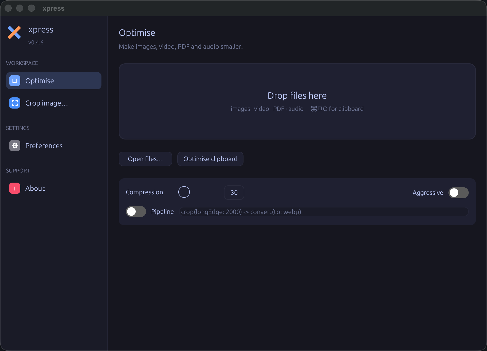

# xpress

[](https://github.com/kwhorne/xpress/actions/workflows/ci.yml)
[](https://github.com/kwhorne/xpress/actions/workflows/release.yml)
[](LICENSE)

**xpress** makes your media smaller — images, videos, PDFs and audio — without
the fuss. Point it at a file, a folder, or your clipboard and it produces a
leaner version that looks and sounds the same, so things upload faster, attach
under size limits, and take up less space.



One tool, three ways to use it:

- **Command line** (`xpress`) — optimise, downscale, crop, convert formats, and
  run multi-step pipelines on single files or whole folders.
- **Background daemon** (`xpress watch`) — automatically optimise new files in
  watched folders, or images you copy to the clipboard.
- **Desktop app** (`xpress-gui`) — drag files in, see the savings, crop
  interactively, and optimise the clipboard with a global hotkey.

## What it does

- **Optimise** images (JPEG/PNG/GIF), video (H.264), PDFs and audio with a single
  compression dial (5 = best quality → 100 = smallest).
- **Downscale** images and videos by a factor, or **crop** to a size, aspect
  ratio or long edge.
- **Convert** between formats: images (WebP/AVIF/HEIC/JXL/PNG/JPEG), audio
  (AAC/MP3/Opus/WAV/FLAC/AIFF), and video (MP4/HEVC/AV1/WebM, or animated GIF).
- **Compress to a budget** (`--max-size 500kb`) or let it **pick the smallest
  format** automatically (`--adaptive`).
- **PDF tools**: non-destructive crop/uncrop and rendering pages to images.
- **Pipelines**: chain steps like `crop(width: 1600) -> convert(to: webp)`, save
  them by name, and attach them to folders for hands-off automation.
- **Non-destructive by default**: originals are backed up and can be restored.

Images **and PDFs** are optimised, resized, cropped and converted **entirely in
pure Rust** (`imagequant` + `oxipng` + `image` + `lopdf`) — no external tools to
install. Video and audio use `ffmpeg`, which the macOS app **bundles**, so a
released `.app`/`.dmg` needs nothing installed. Everything is driven by one
consistent, percentage-based compression model.

xpress is free and open source under the [MIT License](LICENSE).

## Documentation

Full docs live in [`docs/`](docs/README.md):
[installation](docs/installation.md) ·
[CLI reference](docs/cli.md) ·
[pipeline DSL](docs/pipelines.md) ·
[daemon & automations](docs/daemon.md) ·
[desktop GUI](docs/gui.md) ·
[architecture](docs/architecture.md) ·
[contributing](docs/contributing.md).
See [CHANGELOG.md](CHANGELOG.md) for release history.

## Architecture

```
xpress/
  crates/
    xpress-core/   # the optimisation engine (no UI)
      compression  # one 5–100 value mapped to each format's quality knob
      image        # pure-Rust PNG/JPEG/GIF/WebP optimise, convert, resize, crop
      video        # ffmpeg H.264 + codec conversion, video→GIF, speed/fps
      audio        # ffmpeg encoders (aac/mp3/opus/wav/flac/aiff)
      pdf          # pure-Rust optimise (lopdf + image), crop/uncrop
      scale, crop  # resolution scaling and cropping
      pipeline     # the step DSL + saved pipelines + folder automations
      update       # GitHub release checks + self-update
      tools        # external-binary resolution + process execution
      result       # OptimisationResult, backups, options
    xpress-cli/    # `xpress` binary — CLI + watch daemon
    xpress-gui/    # `xpress-gui` binary — menu-bar desktop app (egui/eframe)
```

## Desktop app

```sh
cargo run -p xpress-gui --release
```

* **Lives in the macOS menu bar** — a status-bar icon (Open / Optimise clipboard
  / Check for updates / Quit). Closing the window hides it there; it keeps running.
* **Global hotkeys**: **⌘⇧O** optimises the clipboard image, **⌘⇧X** brings the
  window to the front — from anywhere.
* **Drag and drop** images, videos, PDFs or audio to optimise them; result cards
  show the saving, a thumbnail, and **Reveal** / **Copy** actions.
* An interactive **Crop** tool, a **compression** slider, *aggressive* / *backup*
  / *strip metadata* toggles, and an inline **pipeline** field.
* **Self-updating**: when a new release lands, **Update & Restart** downloads it,
  swaps the app, and relaunches — no trip to the browser.
* Work runs off the UI thread, so the window stays responsive.

### Build a macOS `.app`

```sh
cargo build --release -p xpress-gui -p xpress-cli
scripts/fetch-static-tools.sh aarch64-apple-darwin bundle-tools   # portable ffmpeg
scripts/make-app.sh --bin-dir bundle-tools    # -> dist/xpress.app (menu-bar app)
scripts/make-dmg.sh                           # -> dist/xpress.dmg
```

The app is a menu-bar (agent) app that bundles `ffmpeg`, and is signed with a
Developer ID when one is available. Tagged releases publish a **signed and
notarised** `xpress-*-app.zip` and `xpress-*.dmg`. See
[docs/signing.md](docs/signing.md) for signing + notarisation (locally and in CI).

The app icon lives at `assets/AppIcon.icns`. To regenerate it from the vector
source after editing `assets/icon.svg`:

```sh
cargo run --manifest-path tools/icon-gen/Cargo.toml --release -- assets/icon.svg assets/xpress.iconset
iconutil -c icns assets/xpress.iconset -o assets/AppIcon.icns
```

## Optimisation tools

**Images and PDFs need no external tools** — they're handled in pure Rust. Only
**video and audio** require `ffmpeg`, which the macOS `.app` bundles (so a
released build needs nothing installed). A few extras are optional: `ghostscript`
(PDF `extract-pages`), `heif-enc`/`cjxl` (HEIC/JXL conversion), `gifski`
(higher-quality video→GIF), `exiftool` (metadata).

When running the CLI or from source, xpress finds a tool in this order:
`$XPRESS_BIN_DIR/<tool>` → a `bin/` dir next to the executable → the per-user
bundle dir (`~/Library/Application Support/xpress/bin`) → the system `PATH`.

```sh
xpress doctor    # show which tools are found

# Get a portable ffmpeg without a package manager:
scripts/fetch-static-tools.sh aarch64-apple-darwin "$HOME/Library/Application Support/xpress/bin"
```

Bundled binaries keep their own upstream licences — see [NOTICE.md](NOTICE.md)
before redistributing xpress together with them.

## Usage

```sh
# Optimise anything (auto-detects type)
xpress optimise photo.png screencast.mov document.pdf

# A whole folder, recursively, with the aggressive preset
xpress optimise -r --aggressive ~/Screenshots

# Fine-grained compression (5 = best quality .. 100 = smallest)
xpress optimise --compression 64 photo.jpg

# Restrict to one media kind, downsample PDFs to 144 dpi
xpress optimise --kind pdf --pdf-dpi 144 *.pdf

# Convert audio
xpress convert --to mp3 --bitrate 192 recording.wav

# Crop to a size, an aspect ratio, or a long edge
xpress crop --size 1200x630 banner.png
xpress crop --size 16:9 --smart-crop photo.jpg
xpress crop --size 1920 --long-edge shot.png

# Pipelines: chain steps with `->`
xpress pipeline run 'crop(width: 1600) -> convert(to: webp) -> downscale(factor: 0.5)' photo.png
xpress pipeline add web 'crop(width: 1600) -> convert(to: webp)'
xpress pipeline run web *.png
xpress pipeline list

# Watch folders (and the clipboard) and optimise automatically
xpress pipeline attach ~/Screenshots 'crop(longEdge: 2000) -> convert(to: webp)' --type image
xpress watch                     # uses the saved automations
xpress watch --clipboard ~/Inbox # watch a folder + the clipboard

# Strip metadata
xpress strip-exif *.jpg
```

### Pipeline DSL

Steps are joined with `->` and run left-to-right, each feeding the next:

| Step | Example |
|------|---------|
| `optimise` | `optimise` |
| `downscale(factor:)` | `downscale(factor: 0.5)` or `downscale(factor: 50%)` |
| `crop(width:, height:, longEdge:, ratio:, smart:)` | `crop(width: 1600)`, `crop(ratio: 16:9)` |
| `convert(to:)` | `convert(to: webp)` (image) / `convert(to: mp3)` (audio) |
| `stripExif` | `stripExif` |
| `removeAudio` | `removeAudio` (video) |
| `changeSpeed(factor:)` | `changeSpeed(factor: 2.0)` |
| `capFps(fps:)` | `capFps(fps: 30)` |
| `lowerBitrate(kbps:)` | `lowerBitrate(kbps: 128)` (audio) |

Originals are backed up next to the file as `.<name>.orig` unless `--no-backup`.

## Development

```sh
cargo build
cargo test
cargo run -p xpress-cli -- doctor
```

---

Developed with love by [Knut W. Horne](https://kwhorne.com).
