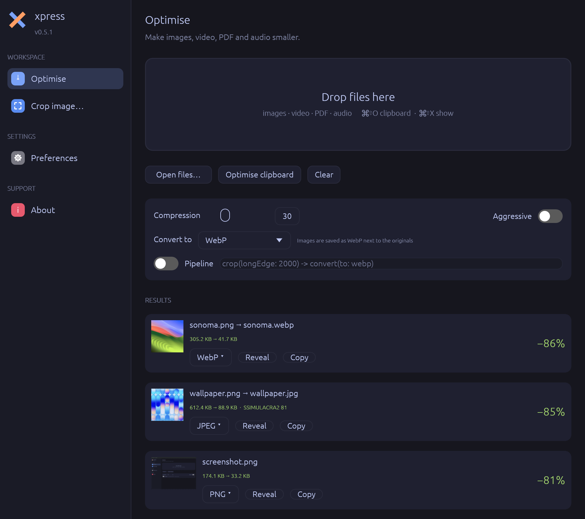

# The desktop app



The xpress app is a small **menu-bar app** for macOS: drag files onto its window
(or press a hotkey) and they come out smaller. Everything the command line can
do to a single file is a click away; batch automation lives in
[pipelines](pipelines.md) and the [watcher](daemon.md).

## First launch

The first time you open xpress, a short **welcome tour** shows the basics —
dropping files, the menu-bar icon, the shortcuts — and lets you turn on the
clipboard history, *Paste directly* and *Open at login* straight away. Skip it
any time; **About → Show the welcome tour** brings it back.

## From Finder

Right-click images, videos, audio files or PDFs in Finder → **Quick Actions**
(or **Services**) → **Optimise with xpress**. xpress opens (or comes to the
front) and optimises them with your current settings, exactly as if you had
dropped them on the window.

The item appears once the app has been opened from *Applications*. If it's
missing, switch it on in **System Settings → Keyboard → Keyboard Shortcuts… →
Services → Files and Folders**; you can also give it a keyboard shortcut there.

## The menu bar and hotkeys

xpress has no Dock icon — look for the **✕** in the menu bar. Its menu has:

| Item | Shortcut | Does |
|------|----------|------|
| Open xpress | ⌘⇧X | Bring the window to the front |
| Optimise clipboard | ⌘⇧O | Optimise the image you copied, and put the smaller one back on the clipboard |
| Clipboard history | ⌃⌘V | Search what you copied and your screenshots, and copy it back ([History](history.md)) |
| Collect clips | | Add everything you copy to one multi-clip, to paste together ([multi-clips](history.md#several-clips-at-once-multi-clips)) |
| Check for updates | | Look for a new version now |
| Quit xpress | | Quit (closing the window only hides it) |

The shortcuts work **from any app**: copy a screenshot, press **⌘⇧O**, and
paste the optimised version; or press **⌃⌘V** to find something you copied
earlier. Change or turn them off in **Preferences → Shortcuts**.

## Optimise

The main screen. Its sidebar entry is **Optimise**.

### Adding files

- **Drag** images, videos, PDFs or audio files onto the window (the drop area
  lights up). Several files at once are fine.
- **Open files…** picks files with a file dialog.
- **Optimise clipboard** takes the image on the clipboard (same as ⌘⇧O).
  Clipboard images are saved to `~/Pictures/xpress`, and the optimised image is
  copied back so your next paste is the small one.

Work happens in the background — the window stays responsive, and the bottom
of the sidebar shows how many files are in progress (*2 working…*).

### Controls

| Control | What it does |
|---------|--------------|
| **Compression** | How hard to compress, from 5 (best quality) to 100 (smallest). 30 is the normal default. See [Optimising](optimising.md#the-compression-dial). Disabled while a *Quality target* is set. |
| **Aggressive** | Use the aggressive preset (compression 64) for noticeably smaller files. |
| **Convert to** | *Keep format* just optimises. Choosing a format (PNG, JPEG, WebP, AVIF, HEIC, GIF, TIFF, BMP) **converts** every image you add instead — saved next to the original, which is kept. A note explains what to expect, e.g. that JPEG has no transparency. Videos, PDFs and audio are still optimised. See [Converting formats](converting.md). |
| **Pipeline** | Run a [pipeline](pipelines.md) on everything you add instead, e.g. `crop(longEdge: 2000) -> convert(to: webp)`. |

### Results

Each file gets a card:

- a **thumbnail** (for images), the **file name** — `photo.png → photo.jpg` when
  the format changed — and the **sizes before → after**;
- the **saving** on the right, e.g. `−62%`; notes such as *already optimised —
  skipped*, *SSIMULACRA2 80* (when a quality target was used) or *copied back*
  (clipboard images);
- a **format chip** for images (e.g. `PNG ▾`): click it to **convert** that file
  to another format;
- **Reveal** (show it in Finder) and **Copy** (put it on the clipboard).

**Right-click** a card for the same actions plus **Crop…**:
*Convert to ▸*, *Crop…*, *Show in Finder*, *Copy*.

**Clear** removes all cards (it doesn't touch the files). Drag-*out* of a card
into another app isn't supported yet — use *Copy* or *Reveal* and drag from
Finder.

## History

Everything you copied and every screenshot you took — once you turn it on —
with search (including the words inside images), filters by kind, app and your
own categories, pinning, multi-clips to paste several things at once, and
optionally pasting straight into the app you were using. ⌃⌘V opens it from any app. See
**[Clipboard and screenshot history](history.md)**.

## Crop image…

Opens an image, shows it full-window, and lets you **drag a rectangle** over the
part to keep. **Apply crop** crops (and optimises) it in place, with a backup;
**Cancel** goes back. The crop tool handles still images, including HEIC and
AVIF. You can also start it from a result card's right-click menu.

For crops to an exact size or aspect ratio, or batches, use
[`xpress crop`](resizing-and-cropping.md).

## Preferences

| Setting | Default | Meaning |
|---------|---------|---------|
| Keep a backup | on | Save the original as `.<name>.orig` next to it. |
| Strip metadata | off | Remove EXIF and XMP (camera, date, location). The colour profile is always kept. |
| Remove location | off | Remove only *where* a photo or video was taken (GPS); keep everything else. See [Sharing and privacy](sharing-and-privacy.md). |
| Quality target | Off | For images: instead of the compression slider, find the **smallest file that still looks** visually lossless / high / medium / low. See [quality targets](optimising.md#quality-targets). |
| Skip already-optimised files | on | Leave files xpress already optimised with these settings (instant, no extra quality loss). |
| Aggressive by default | off | Start with the aggressive preset. |
| Open at login | off | Start xpress in the menu bar when you log in (macOS 13+; it appears in System Settings → General → Login Items). |
| Language | System | **English** or **Norsk** (Norwegian bokmål); *System* follows macOS. Messages from the engine (errors) stay English. |
| Float on top | off | Keep the window above other windows. |
| Default pipeline | `crop(longEdge: 2000) -> convert(to: webp)` | Used when *Pipeline* is switched on. |
| Shortcuts | ⇧⌘O, ⇧⌘X, ⌃⌘V | Click one and press the new keys (with ⌘, ⌃ or ⌥); ⌫ turns it off, esc cancels, *Reset* brings the default back. The menu-bar menu shows the current ones. |
| Clipboard history | off | Record what you copy and your screenshots — with *Include screenshots*, *Find text in images*, *Paste directly*, *Sync with iCloud*, *Keep history* and *Clear…*. See [History](history.md#settings). |

Settings — these and the compression slider, *Aggressive*, *Convert to* and
*Pipeline* on the Optimise screen — are saved automatically and restored the
next time you open xpress. The first launch starts from the command line's
defaults; see [Configuration](configuration.md#desktop-app-settings-guijson).

## About and updates

**About** shows the version and links. When a newer version is published, a
banner appears at the top: **Update & Restart** downloads it, replaces the app
and relaunches — or dismiss it with ✕. The app checks every six hours, and on
demand via *Check for updates*.

## Accessibility

Buttons, toggles and sidebar items are exposed to VoiceOver.

---

## Building the app

For developers — building the `.app`/`.dmg` yourself:

```sh
cargo build --release -p xpress-gui -p xpress-cli
scripts/fetch-static-tools.sh aarch64-apple-darwin bundle-tools   # a portable ffmpeg
scripts/make-app.sh --gui target/release/xpress-gui --bin-dir bundle-tools   # -> dist/xpress.app
scripts/make-dmg.sh                                                # -> dist/xpress.dmg
```

`make-app.sh` signs with the first *Developer ID Application* identity in your
keychain (otherwise ad-hoc), and notarises when `XPRESS_NOTARIZE=1` and Apple
credentials are set — see [Code signing](signing.md). Tagged releases build,
sign and notarise everything in CI.

### App icon

The icon is vector art in `assets/icon.svg`, rendered to `assets/AppIcon.icns`:

```sh
cargo run --manifest-path tools/icon-gen/Cargo.toml --release -- \
  assets/icon.svg assets/xpress.iconset
iconutil -c icns assets/xpress.iconset -o assets/AppIcon.icns
```
