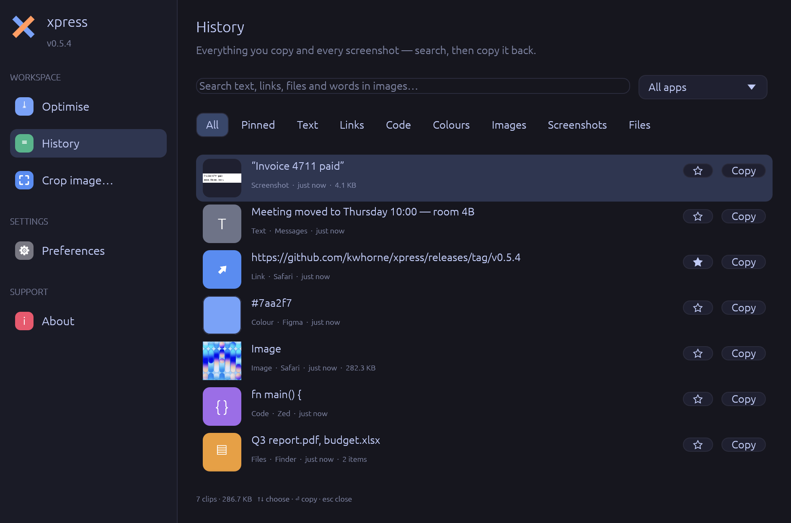

# Clipboard and screenshot history

The desktop app can keep **everything you copy and every screenshot you take**,
so you can find it again later and copy it back — text, links, code, colours,
images and files. Words *inside* images are searchable too: xpress reads the
text in screenshots and copied images.

History is **off until you turn it on**, stays on your Mac, and never records
passwords.

## Turning it on

Open **History** in the sidebar and click **Turn on clipboard history** — or
switch on *Clipboard history* in **Preferences**. From then on, xpress records:

- **What you copy** in any app: text, links, code, colours, images, and files
  copied in Finder.
- **New screenshots** (⌘⇧3, ⌘⇧4, ⌘⇧5), from the folder macOS saves them to.
  Screenshots copied straight to the clipboard (⌃⌘⇧4) are recorded as images.

Only what you copy *after* turning it on is recorded; your existing files and
screenshots aren't imported.

## Finding and pasting

Press **⌃⌘V** in any app (or choose *Clipboard history* from the ✕ menu). The
history opens with the cursor in the search field:

1. **Type** a few letters — words match by prefix and in any order, so
   `inv 47` finds “Invoice 4711”. Accents don't matter (`cafe` finds “café”).
2. **↑ / ↓** to choose, **⏎** to copy. xpress hides itself and puts you back in
   the app you came from — press **⌘V** to paste (or let xpress paste for you,
   see [Paste directly](#paste-directly)).
3. **Esc** clears the selection or the search, or closes the window.

**⌘1 … ⌘9** copy the first nine clips in one go. Double-clicking a clip does the
same as ⏎; **Copy** on a row copies it and leaves the window open.

The search covers the text of each clip, the **text recognised in images**,
file names and paths, and the name of the app it came from.

### Filters

Under the search field:

| Filter | Shows |
|--------|-------|
| **All** | Everything, most recently used first |
| **Pinned** | Clips you've pinned |
| **Text**, **Links**, **Code**, **Colours** | Copied text, sorted by what it looks like |
| **Images**, **Screenshots** | Copied images; screenshots from the screenshot folder |
| **Files** | Files and folders copied in Finder |
| **All apps ▾** | Only clips copied from one app |

Each row shows a preview (a thumbnail, a colour swatch, or an icon), the first
line, and *kind · app · when · size*. Copying a clip again moves it to the top.

### Right-click a clip

| Item | Does |
|------|------|
| Copy | Put it on the clipboard |
| Copy text in image | Copy the words recognised in a screenshot or image |
| Apple Intelligence ▸ | Summarise, proofread or rewrite the text (see [below](#apple-intelligence)) |
| Open link | Open a link clip in your browser |
| Show items | For a multi-clip: list what's in it (← Back returns) |
| Show in Finder | Reveal a copied file, or the stored image |
| Pin / Unpin | Pinned clips are never removed automatically (also ☆ on the row) |
| Categories ▸ | Tick the categories it belongs to, or make a new one |
| Delete | Remove it from the history |

## Several clips at once: multi-clips

A **multi-clip** holds several clips — text, links, images, files, from
different apps — to paste **all at once**.

**Pick clips and combine them.** **⌘-click** rows to pick them (in the order
you want them pasted), or **⇧-click** to pick a range. A bar appears:

| Button | Does |
|--------|------|
| **Copy together** (or ⏎) | Make a multi-clip of the picked clips and copy it |
| **Combine** | Make the multi-clip and keep it in the history |
| **Add to category** | Put all picked clips in a category |
| **Pin**, **Delete** | For all picked clips |
| **×** | Clear the selection (or press Esc) |

**Or collect as you go.** Click **⧉ Collect** at the top of History (or choose
*Collect clips* in the ✕ menu), then copy things in any apps as usual: each copy
is added to one multi-clip. Click **Done** when you have everything.

**What gets pasted:**

- In a plain text field: all the text, links and file paths, one after another.
- In rich editors (Mail, Notes, Pages, documents in the browser): the text *and*
  the images, in order.
- If every item is a file: all the files — paste in Finder to copy them there.
- In apps that only take a picture: the first image.

A multi-clip shows how many items it has; right-click → *Show items* lists
them. Its items stay in the history as clips of their own, and are kept as long
as the multi-clip is (pin the multi-clip to keep it all). Deleting an item takes
it out of the multi-clip; deleting the multi-clip leaves the items.

## Categories

Group clips your own way — *Work*, *Receipts*, *Design* — under the kind
filters. Click a category to show only its clips; click it again for all.

- **+ Category** makes one: a name, a colour, and optionally a rule.
- **Rules** add clips automatically: *Copied in* an app, of a *Kind*, and/or
  *Containing* words (also words found inside images — a screenshot of a receipt
  lands in *Receipts* once its text is recognised). Everything set must match.
  A new rule also sorts the clips already in the history.
- **By hand**: right-click a clip → *Categories ▸*, or pick several and *Add to
  category*.
- **Right-click a category** to edit or delete it. Deleting a category keeps
  its clips.

Clips show a coloured dot for each category they're in.

## Paste directly

Normally, choosing a clip puts it on the clipboard and steps aside so you press
⌘V. With **Paste directly** on (Preferences → Clipboard history), xpress presses
⌘V for you in the app you came from: **⌃⌘V → type → ⏎** and it's pasted.

macOS only allows this with your permission. The first time you switch it on,
macOS asks; allow **xpress** under **System Settings → Privacy & Security →
Accessibility**. Until then, Preferences shows a reminder with an *Open
Settings* button, and xpress only copies.

## Apple Intelligence

On a Mac with **Apple Intelligence** (macOS 26 or later, Apple silicon, turned
on in System Settings → Apple Intelligence & Siri), right-click a text clip — or
a screenshot or image with recognised text, or a multi-clip — and choose
**Apple Intelligence**:

| | |
|---|---|
| **Summarise** | The key points in a few sentences or bullets |
| **Proofread** | Fix spelling, grammar and punctuation, nothing else |
| **Make shorter** | Say the same in fewer words |
| **Make professional** | Clear and polite, for work |
| **Make friendly** | Warm and relaxed |
| **Translate to English** | Into natural English |

The text keeps its language (except when translating). The result appears in a
window: **Copy** it, **Save to history** to keep it as a new clip (from *Apple
Intelligence*), or close it.

It runs on Apple's **on-device** model — nothing is sent anywhere — and takes a
second or two. Very long text is cut to about 8,000 characters. When Apple
Intelligence is off or still getting ready, the menu item is greyed out and
says why; on older macOS versions it isn't shown.

## Sync between your Macs

Turn on **Sync with iCloud** in Preferences → Clipboard history on each Mac. The
history then follows you: what you copy on one Mac shows up on the others,
usually within a minute (xpress checks every 10 seconds; iCloud decides how fast
files travel) — clips, images and screenshots, multi-clips, pins and
categories. Deleting a clip (or *Clear…*) removes it everywhere.

- It goes through **iCloud Drive**, in a folder called `xpress`, so iCloud
  Drive must be on (System Settings → Apple Account → iCloud). Preferences shows
  when it last synced and with which Macs.
- Each Mac writes its own changes there and reads the others'; nothing is
  overwritten, and the same text copied on two Macs is one clip.
- Images arrive once iCloud has copied them; until then Preferences shows
  “changes waiting for iCloud”.
- How long clips are kept is set **per Mac** (*Keep history*): one Mac can keep
  a year while another keeps a week. Old clips from other Macs aren't brought in
  only to be removed again.
- Turning sync on uploads this Mac's history once; turning it off stops sharing
  (the clips stay). To stop syncing everywhere, turn it off on every Mac, then
  delete the `xpress` folder in iCloud Drive.

**Privacy:** the folder holds your clips as files in your iCloud Drive. With
**Advanced Data Protection** on (System Settings → Apple Account → iCloud) they
are end-to-end encrypted; otherwise Apple's standard iCloud protection applies.
Passwords and other private clipboard content are never recorded, so never
synced.

## What's recorded, and what isn't

xpress decides what a copy is, in this order:

- **Files** copied in Finder are kept as a list of paths (with a preview for a
  single image). The files themselves aren't copied into the history.
- **Text** wins over a picture of the same content (Word, Excel and Keynote put
  both on the clipboard).
- **Images** — unless the only text alongside is the image's address, which is
  what browsers add when you *Copy Image*.
- Text is sorted into **links** (`https://…`, `www.…`, `mailto:`), **colours**
  (`#7aa2f7`, `rgb(…)`, `hsl(…)`), **code** (by its shape: braces, semicolons,
  indentation, keywords) or plain **text**.

The same content copied twice is one clip — it moves back to the top. Images
count as the same when their pixels are.

**Never recorded:**

- Anything an app marks as **private or temporary** on the clipboard — password
  managers do this for passwords and one-time codes (the
  [nspasteboard.org](http://nspasteboard.org) markers, and 1Password's own).
- Anything copied while **Passwords, Keychain Access, 1Password, Bitwarden,
  KeePassXC or Dashlane** is in front.
- Text over 5 MB.

## Text in images (OCR)

With *Find text in images* on (the default), xpress reads the words in every
new screenshot and copied image with macOS's built-in text recognition. It runs
**on your Mac** — nothing is uploaded — and recognises many languages. The
words appear as the clip's title (“Invoice 4711 …”), are searchable, and can be
copied with *Copy text in image*.

## How long it's kept

*Keep history* in Preferences: 1 day, 1 week, **1 month** (default), 3 months,
1 year or forever. Older clips are removed about once an hour, oldest first;
**pinned clips are always kept**. Whatever you choose, the history never grows
past **2 GB** — the oldest unpinned clips go first.

**Clear…** in Preferences deletes every clip except pinned ones (click twice to
confirm). To delete a single clip, right-click it → *Delete*.

## Where it's stored

In the `history` folder next to the config files —
`~/Library/Application Support/xpress/history` on macOS:

| | |
|---|---|
| `history.db` | The clips, multi-clips, categories and the search index (SQLite) |
| `images/` | Copied images and screenshots; PNGs are recompressed losslessly, so they take less room than the originals |
| `thumbs/` | Small previews |

Screenshots are **copied** into the history, so deleting the original from your
Desktop doesn't remove it from the history (and vice versa). Turning the history
off stops recording; the clips stay until you clear them.

## Settings

All in **Preferences → Clipboard history**:

| Setting | Default | |
|---------|---------|---|
| Clipboard history | off | Record what you copy |
| Include screenshots | on | Also record new screenshots |
| Find text in images | on | Recognise words in images (macOS) |
| Paste directly | off | Paste the chosen clip into the app you were using (needs Accessibility permission) |
| Sync with iCloud | off | Share the history between your Macs through iCloud Drive |
| Keep history | 1 month | How long unpinned clips are kept |
| Clear… | | Delete all unpinned clips (and multi-clips that aren't pinned) |

## Platforms

Everything above is for **macOS**. On Linux the app records copied **text**
only, without the source app; there's no text recognition, a multi-clip is
pasted as text, and *Paste directly*, Apple Intelligence and iCloud sync
aren't available.
